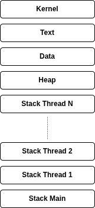

# Concorrenza

Esecuzione simultanea di diversi processi/thread.


> [!IMPORTANT]
>
> I **processi** sono unità indipendenti di esecuzione
> mentre i **thread** condividono uno[^1] spazio in memoria,
> da qui un costo ridotto per cambio di contesto ed eliminazione.

[^1] Ci sono comunque spazi non condivisi come lo stack, ecc.

## Tipi di thread

### User Space (o green thread)

Non riconusciuti dall'OS, privati al processo.

* più leggeri rispetto a kernel thread

### Kernel

I thread che vediamo sono riconosciuti dall'OS, possono:

* richiedere accesso a risorse esclusive
* più costosi da creare e gestire

### Hybrid

## Spazio di indirizzamento (Address Space)



## Thread in C11

```c
int thrd_create(thrd_t *thr, thrd_start_t func, void *arg);
```

* `int` (return type): PID del thread creato
* `thread_t* thr`: puntatore al descrittore del thread
* `thrd_start_t func`: cosa deve fare (funzione)
* `void* arg`: argomento da passare alla funzione

```c
int thrd_join(thrd_t thr, int *res);
```

Aspetta che un thread termini.

* `int` (return type): thrd_success se successo, thrd_error altrimenti
* `thrd_t thr`: thread da aspettare

```c
int thrd_detach(thrd_t thr);
```

Stacca un thread dall'ambiente corrent, non è più possibile aspettarlo.

* `int` (return type): thrd_success se successo, thrd_error altrimenti
* `thrd_t thr`: thread da staccare


## Problemi coi thread

* Deadlock
* Starvation
* Race conditions
* False sharing

## Atomics in C11

> [!NOTE]
>
> I processori moderni hanno più core, ciascuno ha una cache locale,
l'accesso a variabili vicine in memoria può invalidare la cache di un altro core, causando un rallentamento, questo è chiamato **false sharing**.

```asm
LDR R0, [Ri]
ADD R0, R0, #1 @ 
STR R0, [Ri]
```

> [!IMPORTANT]
>
> C11 fornisce un supporto per operazioni atomiche mediante varialibi
> che possono essere scritte/lette in modo atomico.
> Con ciò si può implementare uno **spinlock**

> [!NOTE]
>
> Per adoperare variabili atomiche bisogna usare funzioni specifiche,
> ma in certi casi il compilatore può riconoscere op non atomiche
> su dati atomici e trasformarle in atomiche, ad esempio `++` su un `atomic_int`

### Spinlock

```c
#include <stdatomic.h>

void spinlock(atomic_flag *lock) {
    while (atomic_flag_test_and_set(lock)) {
        // spin
    }
}

void spinunlock(atomic_flag *lock) {
    atomic_flag_clear(lock);
}
```

L'atomic_flag è un tipo di dato che può essere testato e settato in modo atomico, è usato per implementare spinlock.
Data la sua semplicità, è implementato da praticamente tutte le architetture.

> [!TIP]
>
> Perché non ridurre tutto all'uso di atomiche?
> Non tutte le operazioni possono essere ridotte a tali, o almeno non semplicemente
>
> Ad esempio per l'inserimento in coda a una lista, bisogna mantenere un lock sulla lista.

### Mutex

```c
mtx_t mutex;
```

### Condition variables

> [!TIP]
>
> Simili al concetto di wait e notify di Java, permettono a un thread di aspettare che una certa condizione sia vera, e a un altro thread di notificare quando quella condizione è vera.

> [!IMPORTANT]
>
> Anche note come barrier: punti di sincronizzazione per tutti i thread
> o più generalmente per processi, lavorano finché tutti raggiungono
> un certo punto, e poi tutti possono continuare.
